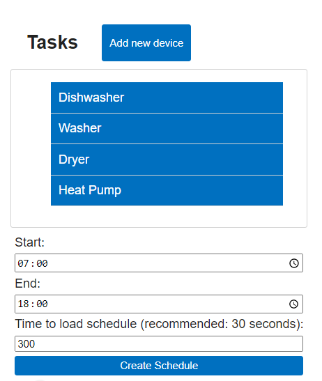
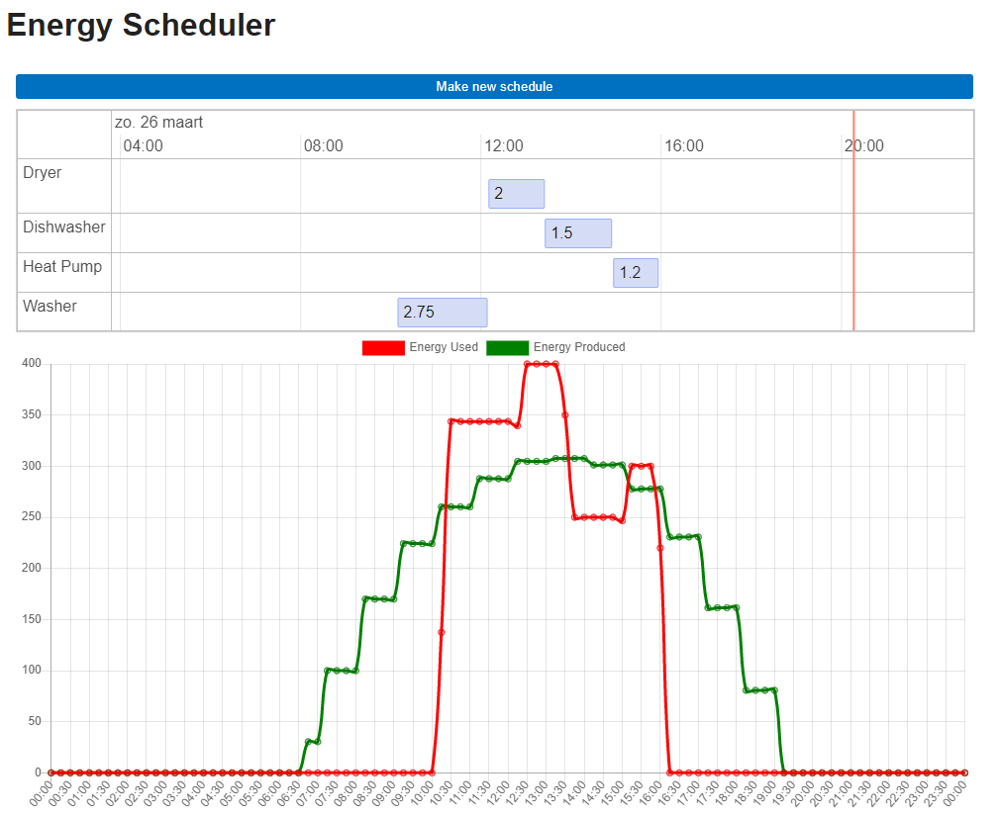

# Energy Scheduler repository

## Energy Scheduler Add-on

![Supports aarch64 Architecture][aarch64-shield]
![Supports amd64 Architecture][amd64-shield]
![Supports armhf Architecture][armhf-shield]
![Supports armv7 Architecture][armv7-shield]
![Supports i386 Architecture][i386-shield]

## About

Energy Scheduler is a tool designed to help users efficiently manage their energy consumption by scheduling their devices based on solar energy production and other information provided by the user.

With the increasing popularity of solar power, more people are interested in utilizing renewable energy sources to reduce their carbon footprint and save money on energy bills. However, one of the challenges with solar power is that it is not always available when you need it. This is where Energy Scheduler comes in handy.

For example, if the solar energy production is high in the middle of the day, Energy Scheduler may recommend running energy-intensive appliances like washing machines or dishwashers during that time. This helps to reduce reliance on grid electricity and optimize the use of renewable energy.

[aarch64-shield]: https://img.shields.io/badge/aarch64-yes-green.svg
[amd64-shield]: https://img.shields.io/badge/amd64-yes-green.svg
[armhf-shield]: https://img.shields.io/badge/armhf-yes-green.svg
[armv7-shield]: https://img.shields.io/badge/armv7-yes-green.svg
[i386-shield]: https://img.shields.io/badge/i386-yes-green.svg

[aarch64-shield]: https://img.shields.io/badge/aarch64-yes-green.svg
[amd64-shield]: https://img.shields.io/badge/amd64-yes-green.svg
[armhf-shield]: https://img.shields.io/badge/armhf-yes-green.svg
[armv7-shield]: https://img.shields.io/badge/armv7-yes-green.svg
[i386-shield]: https://img.shields.io/badge/i386-yes-green.svg
